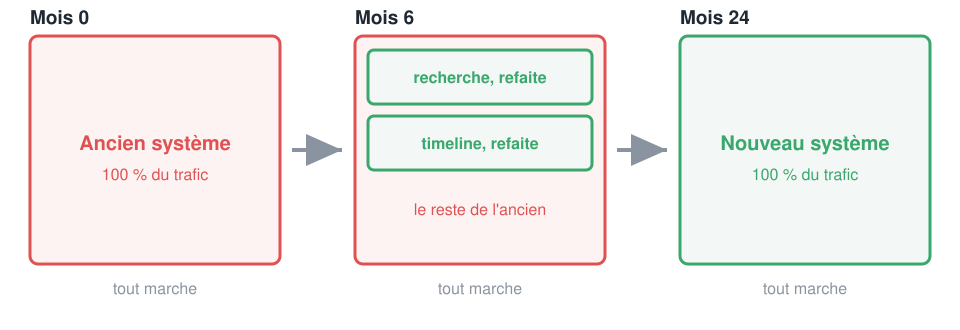
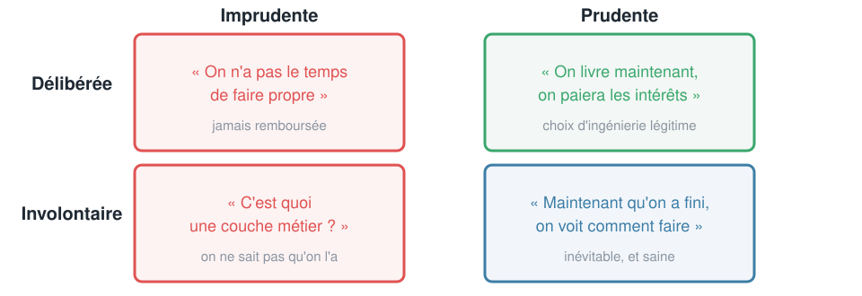
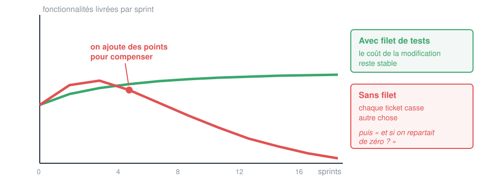
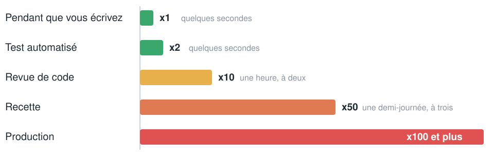
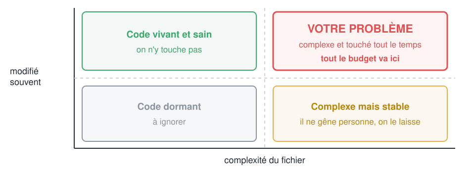
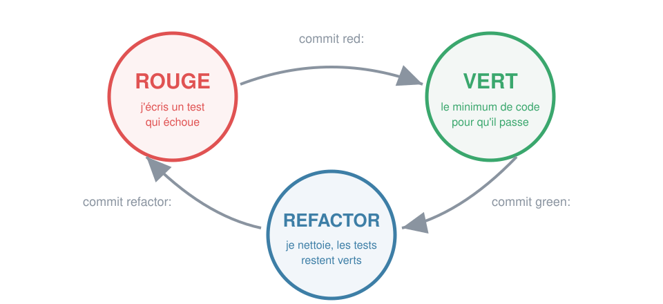

<!-- _class: lead -->

# Crafting Code
## Jour 1
### Écrire du code qu'on peut encore modifier dans six mois

Badmavasan KIROUCHENASSAMY
CODA

---

## Ce que vous saurez faire ce soir
### Les cinq sorties de la journée

- **Expliquer** pourquoi un code sale tue l'agilité, chiffres réels à l'appui
- **Reconnaître** les indicateurs d'un code propre, et ceux qui se mesurent
- **Faire tourner** une chaîne d'outils open source qui note votre code
- **Dérouler** un cycle TDD complet, avec un git qui le prouve
- **Sécuriser** du code existant avant d'y toucher

---

## Le déroulé
### 3 heures de cours, 5 heures de TP

| Bloc | Durée | Contenu |
|---|---|---|
| Acte 1 | 45 min | Pourquoi le clean code, et le lien avec l'agilité |
| Acte 2 | 50 min | Les indicateurs, mesurables et non mesurables |
| Acte 3 | 35 min | Les outils open source, 2 démos |
| Acte 4 | 50 min | TDD et tests unitaires, 1 démo complète |
| TP1 | 5 h | Vous, un code sale, et un dépôt git qui vous juge |

> Tout ce qu'il faut pour le TP est dans ces slides. Gardez-les ouvertes.

---

<!-- _class: lead -->

# Acte 1
## Le code coûte cher
### Mais pas là où vous croyez

---

## Pour commencer
### Levez la main

- Qui a déjà dit « ce code est pourri, on devrait tout refaire » ?
- Qui a déjà eu **peur** de modifier une fonction ?
- Qui a déjà passé plus de temps à **comprendre** qu'à écrire ?
- Qui a déjà cassé quelque chose **sans le savoir** ?

> On va voir ce que ces quatre situations ont en commun.

---

<!-- _class: chiffre -->

# 10 : 1

### Le ratio entre le temps passé à lire du code et le temps passé à l'écrire

Robert C. Martin, *Clean Code*, 2008

---

## Ce que ce ratio implique
### La seule justification économique dont vous avez besoin

- Chaque ligne écrite sera relue **dix fois**
- Optimiser la vitesse d'écriture, c'est gagner **1** et perdre **10**
- Vous êtes payés pour **comprendre** du code, pas pour en écrire

> Le clean code n'est pas une question de goût. C'est une question de coût.

---

## Le vrai budget d'un logiciel
### Robert Glass, 2002

| Phase | Part du coût total |
|---|---|
| Écriture initiale | 20 % à 60 % |
| **Maintenance** | **40 % à 80 %** |

- Dans la maintenance, la correction de bugs est **minoritaire**
- Le gros du temps part dans l'évolution et la **compréhension**

---

<!-- _class: compare -->

## Le test des 10 secondes
### Ces deux codes font exactement la même chose

#### Version A

```python
def c(l, t):
    r = 0
    for i in l:
        if i[2] > 0:
            if t == "p":
                r += i[1] * i[2] * 0.9
            else:
                r += i[1] * i[2]
    return round(r, 2)
```

#### Version B

```python
def total_commande(lignes, est_pro):
    remise = 0.9 if est_pro else 1.0
    return round(
        sum(
            ligne.prix * ligne.quantite * remise
            for ligne in lignes
            if ligne.quantite > 0
        ),
        2,
    )
```

---

## Débrief
### Sur lequel acceptez-vous de corriger un bug ce soir à 18h ?

- Les deux sont **corrects**
- Les deux passent les **mêmes tests**
- Un seul est **modifiable** par quelqu'un qui ne l'a pas écrit

> La différence n'est pas esthétique. Elle est économique.

---

## La phrase qui coûte des années
### Vous l'avez déjà entendue

> « De toute façon ce code est illisible, on va plus vite à tout refaire. »

- Prononcée dans toutes les équipes, environ **une fois par trimestre**
- Parfois vraie
- **Très souvent fausse**
- Et quand elle est fausse, la facture est publique

---

## Netscape
### 1997 à 2003, le cas d'école

| Chronologie | Ce qui s'est passé |
|---|---|
| Point de départ | plus de **80 %** du marché en 1996 |
| Décision | réécrire le moteur de rendu **de zéro** |
| Le trou | aucune version compétitive de **1998 à fin 2000** |
| Pendant ce temps | Internet Explorer passe de 20 % à plus de **80 %** |
| Fin | équipe dissoute par AOL, **15 juillet 2003** |

---

## Joel Spolsky, 6 avril 2000
### « Things You Should Never Do, Part I »

> Le vieux code a été **testé**. Chaque ligne bizarre que vous ne comprenez pas est probablement une **correction de bug réelle** que personne n'a documentée.

- Réécrire de zéro, c'est jeter des années de connaissance
- Le code neuf aura les mêmes bugs, **pas encore découverts**
- Le code existant a une propriété que le vôtre n'a pas : **il tourne en production**

---

## Pourquoi on croit toujours qu'il faut réécrire
### Un biais, pas un diagnostic

- Lire du code est **plus dur** que d'en écrire
- Quand vous lisez, vous **reconstruisez** un modèle mental
- Quand vous écrivez, ce modèle est **déjà** dans votre tête
- Donc le code des autres paraît toujours pire

> La bonne question n'est jamais « ce code est-il beau », c'est « ce code est-il **mesurablement** difficile à changer ». D'où l'acte 2.

---

## Digg v4
### 25 août 2010

| Le dossier | Les faits |
|---|---|
| Levée de fonds | environ **45 M$** |
| Offre évoquée en 2008 | environ **200 M$** |
| La décision | réécriture complète, déployée **en une fois** |
| Résultat | fonctionnalités perdues, trafic effondré, exode vers Reddit |
| Revendu en juillet 2012 | environ **500 000 $** |

---

## Le fil rouge
### Aucune de ces deux catastrophes n'est technique

- Aucune n'est due à un **algorithme trop difficile** ou à une techno manquante
- Les deux sont dues à du code que **plus personne ne comprenait**
- Netscape : on ne comprend plus, donc on **jette tout**
- Digg : on remplace tout **d'un coup**, sans filet

> Pas de tests plus pas de lisibilité égale **peur**. Et la peur produit soit la paralysie, soit le big bang.

---

## Le contre-exemple
### Twitter, 2009 à 2012

- 2008 : la **baleine d'erreur** devient un mème mondial
- Le monolithe Ruby ne tient plus la charge
- Ils **ne réécrivent pas tout d'un coup**
- Recherche, puis timeline, puis routage, un service à la fois
- Août 2013 : **143 199 tweets par seconde**, sans tomber

---

## Le motif de l'étranglement
### Martin Fowler, 2004



---

<!-- _class: compare -->

## Big bang contre étranglement
### Deux façons de remplacer un système

#### Le big bang

- On développe 18 mois **à côté**
- On bascule **un lundi matin**
- Pendant 18 mois, **zéro valeur livrée**
- Si ça rate, on **ne peut pas revenir**
- Digg, Netscape

#### L'étranglement

- On remplace **un morceau** à la fois
- Chaque morceau part **en production**
- De la valeur livrée **en continu**
- Si ça rate, on revient **sur un morceau**
- Twitter

> Condition unique pour la colonne de droite : des **tests** qui prouvent que le comportement n'a pas changé.

---

## La dette technique
### Ward Cunningham, OOPSLA 1992

- Livrer du code imparfait, c'est **emprunter**
- On va plus vite maintenant, on paie des **intérêts** sur chaque évolution
- Ce que tout le monde oublie : Cunningham parlait d'une dette **contractée sciemment** et **remboursée vite**

> Il l'a redit en 2009 : sa métaphore n'a jamais voulu dire « écrire du mauvais code, c'est acceptable ».

---

## Les quatre dettes
### Toutes ne se valent pas



---

## Snowbird, Utah
### 11 au 13 février 2001

- **17 personnes**, une station de ski, un week-end
- Objectif : un terrain d'entente entre XP, Scrum, DSDM, Crystal, FDD
- Résultat : **4 valeurs**, **12 principes**
- Beck, Cunningham, Martin, Jeffries, Fowler venaient tous de l'**Extreme Programming**

> L'agilité est née d'un mouvement d'**ingénierie**, pas de management.

---

## Le principe que personne ne cite
### Principe n°9 du manifeste agile

> « Une attention continue à l'**excellence technique** et à une bonne conception **renforce** l'agilité. »

- Le mot important est **renforce**
- Ce n'est pas un bonus, c'est un **prérequis**
- Principe n°2 : accueillir les changements, **même tard**

> Impossible d'accueillir un changement tardif si chaque modification casse trois choses ailleurs.

---

## Ce qui se passe vraiment
### Quand la qualité technique n'est pas là



---

## Le scénario, sprint par sprint
### Vous l'avez peut-être déjà vécu

| Sprints | Ce qu'on observe | Ce qu'on fait |
|---|---|---|
| 1 à 3 | tout va vite | on est content |
| 4 à 8 | la vélocité baisse | on ajoute des points |
| 9 à 14 | chaque ticket en casse un autre | sprint de stabilisation |
| 15 | « et si on repartait de zéro » | retour à Netscape |

> Les cérémonies n'ont rien changé, parce que le problème est **dans le code**.

---

## Trouver un bug tôt, ça vaut combien
### Barry Boehm, 1981



---

## L'objectif de la journée en une phrase
### Raccourcir la boucle de retour

- Moins de temps entre **écrire** une erreur et **la voir**
- C'est tout ce que font le clean code, les outils et le TDD
- Chaque acte de la journée attaque la même courbe

> Le reste, c'est de la mise en œuvre.

---

## Le manifeste Software Craftsmanship
### Fin 2008, publié en 2009

| Le manifeste agile dit | Le craftsmanship ajoute |
|---|---|
| des logiciels opérationnels | et aussi **bien conçus** |
| l'adaptation au changement | et aussi l'**ajout constant de valeur** |
| des individus et leurs interactions | et aussi une **communauté de professionnels** |
| la collaboration avec les clients | et aussi des **partenariats productifs** |

---

## L'état d'esprit derrière le mot artisan
### Apprenti, compagnon, maître

- On s'entraîne **en dehors** du travail réel, ce sont les **katas**
- On ne livre pas ce dont on a honte, même si le client ne le verra pas
- « Ça marche » est le **minimum**, pas l'objectif
- On laisse le code **un peu plus propre** qu'on ne l'a trouvé

---

## Ce que ça change pour vous demain matin
### Quatre réflexes

- Arrêter de dire « c'est du legacy » et commencer à **mesurer**
- Arrêter de **demander l'autorisation** d'écrire des tests
- Arrêter de livrer un gros morceau, livrer des **petits vérifiables**
- Arrêter de proposer de **tout réécrire**, proposer d'**étrangler**

---

<!-- _class: lead -->

# Acte 2
## Les indicateurs
### Ce qu'un humain voit, ce qu'une machine mesure

---

## L'unité de mesure officielle
### Le dessin de 2008

| Revue de code | Nombre de « c'est quoi ce truc » par minute |
|---|---|
| Bon code | 2 ou 3 |
| Mauvais code | 40 |

- C'est drôle, c'est vrai
- Problème : **impossible à mettre dans une CI**

---

## Deux familles d'indicateurs
### On a besoin des deux

| Jugé par un humain | Mesuré par une machine |
|---|---|
| le nommage | la longueur des fonctions |
| l'intention | la complexité |
| la bonne abstraction | la duplication |
| la cohérence métier | la couverture, le code mort |

> Les outils ne remplacent pas la revue. Ils en retirent tout ce qui est **mécanique**, pour qu'on discute du reste.

---

## Famille 1, le nommage
### Un nom répond à trois questions sans commentaire

- Pourquoi ça **existe**
- Ce que ça **fait**
- Comment on **s'en sert**

> Si vous avez besoin d'un commentaire pour l'expliquer, le nom a échoué.

---

<!-- _class: compare -->

## Le commentaire est la preuve de l'échec
### Règle 1, pas d'abréviation inventée

#### Ce qu'on lit

```python
d = 0   # elapsed time in days
cust = get(1)
tmp = calc(a, b)
l = []
flag = True
```

#### Ce qu'on veut lire

```python
duree_ecoulee_en_jours = 0
client = charger_client(1)
montant_ttc = appliquer_tva(montant_ht, taux)
references_en_alerte = []
livraison_express = True
```

> Le commentaire disparaît tout seul. C'est le test.

---

<!-- _class: compare -->

## Le nom qui ment
### Règle 2, pire que pas de nom du tout

#### Le piège

```python
liste_clients = {}

liste_clients["jean"] = 42

# 200 lignes plus loin
for c in liste_clients:
    # c est une chaine, pas un client
    ...
```

#### La réparation

```python
soldes_par_client = {}

soldes_par_client["jean"] = 42

for nom_client in soldes_par_client:
    ...
```

> Un nom faux coûte plus cher qu'un nom vague, parce qu'on lui fait confiance.

---

## Les six autres règles de nommage
### À appliquer au TP

- **Prononçable** : si on ne peut pas en parler à l'oral, c'est mauvais
- **Cherchable** : `d` ne se cherche pas, `duree_en_jours` oui
- **Pas de préfixe de type** : `strNom`, `iCompteur`, `m_valeur`
- **Un mot par concept** : pas `recuperer`, `obtenir`, `charger` et `fetch` pour la même chose
- **Classes = noms, fonctions = verbes**
- **Longueur proportionnelle à la portée** : `i` dans 3 lignes, jamais au niveau module

---

## Mini-activité, 3 minutes
### En binôme, renommez ces cinq déclarations

| Ce qui est écrit | Ce que ça contient vraiment |
|---|---|
| `d = 0` | un nombre de jours ouvrés qu'on accumule au fil des étapes |
| `def calc(x, y, z)` | `x` prix HT, `y` taux de TVA, `z` remise en pourcentage, renvoie le prix à payer |
| `liste = []` | les références des articles passés sous leur seuil d'alerte |
| `flag = True` | si vrai, le colis part en 24h au lieu du délai standard |
| `class Data` | le nom, le prénom, l'email et la date d'inscription d'un client |

> Deux critères de réussite : le commentaire devient **inutile**, et le nom reste juste **même si on le lit tout seul**, sorti de son fichier.

---

## La correction, une proposition parmi d'autres
### Le raisonnement compte plus que le mot choisi

| Avant | Après | Pourquoi |
|---|---|---|
| `d` | `jours_ouvres_cumules` | l'unité fait partie du nom, personne ne se demande si ce sont des heures |
| `calc()` | `prix_a_payer(prix_ht, taux_tva, taux_remise)` | la fonction est un verbe ou un résultat, et chaque argument dit son rôle |
| `liste` | `references_en_alerte` | le type ne se met pas dans le nom, le contenu si |
| `flag` | `livraison_en_24h` | un booléen se nomme comme une affirmation qu'on peut dire vraie ou fausse |
| `Data` | `Client` | une classe est un nom du métier, pas une catégorie technique |

> Le test final : `if livraison_en_24h:` se lit à voix haute. `if flag:` ne se lit pas, il se devine.

---

## Famille 2, les fonctions
### Les quatre seuils

| Règle | Seuil opérationnel |
|---|---|
| Taille | au-delà de **20 lignes**, vous avez deux fonctions |
| Responsabilité | elle fait **une seule chose** |
| Abstraction | **un seul niveau** par fonction |
| Arguments | 0 idéal, 1 très bien, 2 ok, 3 avec une raison, **4 et plus non** |

---

<!-- _class: compare -->

## Un seul niveau d'abstraction
### Ne mélangez pas la stratégie et la plomberie

#### Mélangé

```python
def traiter_commande(cmd):
    verifier_stock(cmd)
    total = 0
    for i in range(len(cmd.lignes)):
        l = cmd.lignes[i]
        if l.qte > 0:
            total += l.prix * l.qte
    if total > 100:
        total *= 0.95
    envoyer_confirmation(cmd)
```

#### Un seul niveau

```python
def traiter_commande(cmd):
    verifier_stock(cmd)
    total = calculer_total(cmd.lignes)
    total = appliquer_remise(total)
    envoyer_confirmation(cmd)
```

> La fonction du haut se lit comme un **sommaire**. Les détails sont un cran plus bas.

---

<!-- _class: compare -->

## L'argument booléen
### Presque toujours un signal d'alarme

#### Le drapeau

```python
sauvegarder(document, True)
sauvegarder(document, False)

def sauvegarder(doc, brouillon):
    if brouillon:
        ...
    else:
        ...
```

#### Deux fonctions

```python
sauvegarder(document)
sauvegarder_en_brouillon(document)
```

> `True` veut dire quoi ? Le lecteur doit aller **ouvrir la fonction**. Donc le code n'est pas lisible.

---

<!-- _class: compare -->

## Le paquet de données
### Quatre arguments qui voyagent ensemble

#### Le symptôme

```python
def creer_facture(rue, ville, cp, pays,
                  nom, prenom, montant):
    ...

def livrer(rue, ville, cp, pays):
    ...

def verifier_zone(rue, ville, cp, pays):
    ...
```

#### L'objet qui manquait

```python
@dataclass(frozen=True)
class Adresse:
    rue: str
    ville: str
    code_postal: str
    pays: str

def livrer(adresse: Adresse): ...
def verifier_zone(adresse: Adresse): ...
```

> Fowler appelle ça un *data clump*. C'est un objet qui n'a pas encore de nom.

---

<!-- _class: compare -->

## Commande ou question, jamais les deux
### Séparation commande requête, Bertrand Meyer

#### Ambigu

```python
if definir_attribut("user", "jean"):
    ...
```

- Ça change quoi ?
- Ça renvoie quoi ?
- Impossible de savoir sans ouvrir

#### Clair

```python
if attribut_existe("user"):
    definir_attribut("user", "jean")
```

- Une fonction **change** l'état et ne renvoie rien
- Ou elle **répond** et ne change rien

> Bonus : une fonction sans effet de bord est **infiniment** plus facile à tester.

---

<!-- _class: compare -->

## Famille 3, les commentaires
### Le commentaire explique le pourquoi, jamais le quoi

#### Le commentaire de trop

```python
# on verifie si l'employe
# a droit aux avantages
if (employe.drapeaux & HORAIRE) \
        and (employe.age > 65):
    ...
```

#### Le code qui se raconte

```python
if employe.a_droit_aux_avantages():
    ...
```

> Les commentaires **mentent avec le temps**. Le code change, le commentaire reste. Un commentaire faux est pire qu'aucun commentaire.

---

## Les seuls commentaires légitimes
### Quatre cas, pas plus

- Le **pourquoi** : « on trie avant de comparer car l'API ne garantit pas l'ordre »
- L'**avertissement** : « ce test prend 4 minutes, hors boucle rapide »
- La mention **légale** ou de licence
- La décision **contre-intuitive**, avec sa référence de ticket

> Le code commenté n'a aucune excuse. Vous avez git. **Supprimez.**

---

<!-- _class: compare -->

## Famille 4, les erreurs
### L'attrape-tout est interdit

#### Ce qui vous attend en production

```python
try:
    traiter()
except:
    pass
```

- Attrape aussi le Ctrl+C
- Attrape vos fautes de frappe
- Le bug devient **invisible**

#### Ce qu'on écrit

```python
try:
    traiter()
except DonneeInvalide as erreur:
    journal.warning("ignoré : %s", erreur)
    raise
```

> Une exception **dit** ce qui s'est passé. Un code de retour à -1 ne dit rien et se propage en silence.

---

<!-- _class: compare -->

## Le None qui contamine
### Ne renvoyez jamais None pour dire « rien »

#### Le problème se propage

```python
def clients_actifs():
    if not self.connecte:
        return None

# chez chaque appelant
resultat = clients_actifs()
if resultat is not None:
    for c in resultat:
        ...
```

#### On rend le cas neutre

```python
def clients_actifs():
    if not self.connecte:
        return []

for client in clients_actifs():
    ...
```

> Chaque `None` renvoyé force **tous** les appelants à écrire une garde. Et l'un d'eux l'oubliera.

---

## Famille 5, la structure
### Quatre principes, quatre phrases

| Principe | Ce qu'il dit vraiment |
|---|---|
| **DRY** | une **connaissance** a une seule représentation, pas une ligne |
| **KISS** | la solution la plus simple qui marche, pas la plus maligne |
| **YAGNI** | le code écrit « au cas où » n'est jamais utilisé, mais se maintient |
| **Déméter** | ne parlez qu'à vos voisins immédiats |

---

<!-- _class: compare -->

## La loi de Déméter
### Un point, ça va. Quatre, bonjour les dégâts

#### Couplé à quatre classes

```python
code = (commande
        .client
        .adresse
        .ville
        .code_postal)
```

- Si `Ville` change, ce code casse
- Alors qu'il ne parle **que** de commande

#### Couplé à une seule

```python
code = commande.code_postal_livraison()
```

- `Commande` sait déléguer
- Vous ne connaissez **qu'elle**

> Chaque point en trop est une classe de plus qui peut vous casser.

---

## La règle du boy-scout
### Le seul remboursement de dette qui ne passe pas par un chef de projet

- Chaque fois que vous ouvrez un fichier, améliorez **une** chose
- Un nom, une fonction extraite, un commentaire mort supprimé
- **Cinq minutes**, incluses dans le ticket en cours
- Une équipe de six améliore un fichier **plusieurs fois par jour**

> Personne n'a jamais eu besoin de budgéter ça.

---

## Le tableau de bord
### Les seuils qu'on va vérifier au TP

| Indicateur | Vert | Orange | Rouge |
|---|---|---|---|
| Lignes par fonction | < 20 | 20 à 50 | > 50 |
| Complexité cyclomatique | 1 à 5 | 6 à 10 | > 10 |
| Profondeur d'imbrication | 1 à 2 | 3 | 4 et + |
| Nombre de paramètres | 0 à 3 | 4 | 5 et + |
| Lignes par fichier | < 300 | 300 à 500 | > 500 |
| Duplication | < 3 % | 3 à 5 % | > 5 % |
| Couverture de branches | > 80 % | 60 à 80 % | < 60 % |

> Ce ne sont pas des lois de la nature. Ce sont des **conventions d'équipe**, écrites et vérifiées automatiquement.

---

## La complexité cyclomatique
### Thomas McCabe, 1976

On part de **1**, et on ajoute **1** par : `if`, `elif`, `for`, `while`, `and`, `or`, `except`, cas de `match`.

```python
def prix(qte, client, promo):        # 1
    if qte > 10:                     # 2
        p = 8
    elif qte > 5:                    # 3
        p = 9
    else:
        p = 10
    if client == "pro" and promo:    # 4 et 5
        p = p * 0.9
    return p
```

### Complexité = 5

---

<!-- _class: chiffre -->

# = 5 tests

### La complexité cyclomatique est exactement le nombre minimum de tests unitaires pour couvrir toutes les branches

---

## Pourquoi c'est LE chiffre à surveiller
### Le mécanisme exact par lequel un code se fige

- Une fonction à complexité **30** demande **30 tests**
- Personne ne les écrit
- Donc cette fonction n'est **jamais testée**
- Donc personne n'ose la modifier
- Donc on la **contourne**, et la complexité monte encore

> Au-delà de **10**, on découpe. Au-delà de **20**, c'est un incident. Au procès Toyota de 2013, l'expert a montré au jury **67 fonctions au-dessus de 50** dans le calculateur moteur.

---

<!-- _class: compare -->

## Complexité cognitive
### SonarSource, 2016, la version humaine

#### Cyclomatique 5, lisible

```python
if code == "A": return 1
if code == "B": return 2
if code == "C": return 3
if code == "D": return 4
return 0
```

- Un humain lit ça **sans effort**
- Cognitive : **faible**

#### Cyclomatique 5, illisible

```python
if actif:
    for c in commandes:
        if c.valide:
            if c.total > 0:
                ...
```

- Chaque niveau **coûte plus cher** que le précédent
- Cognitive : **élevée**

> La cyclomatique dit **combien de tests écrire**. La cognitive dit **si un humain peut lire**.

---

<!-- _class: compare -->

## L'escalier de la honte
### Le remède s'appelle la clause de garde

#### 6 niveaux d'indentation

```python
def traiter(commandes):
    for c in commandes:
        if c.est_valide():
            if c.client is not None:
                if c.client.actif:
                    for l in c.lignes:
                        if l.quantite > 0:
                            expedier(l)
```

#### 2 niveaux, même comportement

```python
def traiter(commandes):
    for commande in commandes:
        if not commande.est_valide():
            continue
        if not client_actif(commande):
            continue
        expedier_lignes(commande)
```

> On **inverse** les conditions et on **sort tôt**. Chaque règle métier devient lisible isolément.

---

## La duplication
### Trois copies, c'est trois corrections, et une oubliée

- Fowler appelle ça la **chirurgie au fusil à pompe**
- Un changement métier oblige à toucher dix fichiers
- Seuil courant en entreprise : **3 %** maximum

> Nuance : la duplication **accidentelle** existe. Deux codes qui se ressemblent aujourd'hui mais vont diverger demain ne doivent **pas** être fusionnés.

---

<!-- _class: chiffre -->

# 460 M$

### Le prix du code mort chez Knight Capital, 8 ans après qu'on aurait dû le supprimer

---

## Le code mort coûte trois fois
### Et parfois il se réveille

- Il est **lu** par chaque nouvelle personne du projet
- Il est **maintenu par erreur** lors des refactorings globaux
- Il peut se **rallumer** : en 2012, chez Knight Capital, un drapeau de configuration recyclé réactive une fonction morte depuis 8 ans, 45 minutes de trading incontrôlé

> Vous avez git. Supprimer n'est pas perdre.

---

<!-- _class: compare -->

## La couverture de tests et son piège
### Ce qu'elle dit, ce qu'elle ne dit pas

#### Ce qui est vrai

- Les lignes **non couvertes** ne sont testées par personne
- C'est une information **certaine**
- Visez la couverture de **branches**, pas de lignes

#### Le test qui triche

```python
def test_calcul():
    calculer_facture(commande)
```

- Aucune assertion
- Couverture : **100 %**
- Prouve : **rien**

> Un objectif de 100 % imposé par la direction produit mécaniquement des tests sans assertion. Servez-vous en **à l'envers** : lisez la liste des lignes rouges, pas le chiffre global.

---

## Les points chauds
### La carte qui sert vraiment, Michael Feathers



---

## Obtenir cette carte en une commande
### Votre historique git contient déjà la moitié de la réponse

```bash
git log --format=format: --name-only \
  | grep '\.py$' | sort | uniq -c | sort -rn | head -20
```

- La colonne de gauche est la **fréquence de modification**
- `radon cc` vous donne la **complexité**
- Le croisement vous donne l'**ordre d'attaque**

---

## Le catalogue des odeurs
### Fowler, 1999. Une odeur n'est pas un bug, c'est un indice

| Ce qu'on voit en lisant | Ce qu'on découvre en modifiant |
|---|---|
| Fonction longue | Chirurgie au fusil à pompe |
| Classe trop grosse | Changement divergent |
| Liste de paramètres trop longue | Envie de fonctionnalité |
| Code dupliqué | Chaîne de messages |
| Obsession du primitif | Généralité spéculative |
| Paquet de données | Classe paresseuse |
| Commentaires explicatifs | Champs temporaires |

> Jour 3 en profondeur. Aujourd'hui, sachez les **nommer** quand vous les voyez.

---

## Ce que vous devrez remplir au TP
### Une ligne par fichier, avant et après

| Fichier | Lignes | CC max | CC moy | IM | Duplication | Couverture | pylint |
|---|---|---|---|---|---|---|---|
| avant | | | | | | | |
| après | | | | | | | |

- « J'ai rendu le code plus propre » : **pas crédible**
- « La complexité max est passée de 35 à 4, la couverture de 0 à 91 % » : **crédible**

---

<!-- _class: lead -->

# Acte 3
## Les outils
### Ceux qui vous donnent les chiffres

---

## La trousse à outils Python
### Tout est open source, tout s'installe avec pip

| Outil | Ce qu'il mesure |
|---|---|
| `ruff` | lint et formatage, très rapide |
| `pylint` | analyse profonde, score sur 10 |
| `radon` | complexité cyclomatique, indice de maintenabilité |
| `xenon` | transforme un seuil radon en **barrière bloquante** |
| `vulture` | code mort |
| `mypy` | cohérence des types |
| `pytest` + `pytest-cov` | tests et couverture |
| `pre-commit` | bloque les commits non conformes |

---

## Mise en place
### Recopiez ce bloc, vous en aurez besoin au TP

```bash
python3 -m venv .venv
source .venv/bin/activate

cat > requirements-dev.txt <<'EOF'
pytest
pytest-cov
ruff
pylint
radon
xenon
vulture
mypy
pre-commit
EOF

pip install -r requirements-dev.txt
```

---

## Démo 2
### Le patient : demos/demo-outils/avant.py

On ne lit pas encore le fichier. On demande d'abord leur avis aux outils.

```bash
radon cc -s -a avant.py
radon mi -s avant.py
pylint avant.py
ruff check avant.py
vulture avant.py
xenon --max-absolute B --max-modules A --max-average A avant.py
```

> On note les chiffres au tableau **avant** de toucher à quoi que ce soit.

---

## Lire radon cc
### La lettre est le rang, le nombre est la vraie complexité

```
avant.py
    F 18:0 calc - E (35)
    F 111:0 verif - A (3)
    F 103:0 maj - A (1)

Average complexity: B (10.0)
```

- `F` fonction, `C` classe, `M` méthode
- `18:0` ligne et colonne
- **E (35)** : cette fonction est intestable en l'état
- Le nombre entre parenthèses est ce que vous notez dans votre rapport

---

## Lire pylint
### Le préfixe compte plus que le score

```
avant.py:18:0: R0913: Too many arguments (6/5)
avant.py:18:0: R0912: Too many branches (37/12)
avant.py:18:0: R0915: Too many statements (79/50)
avant.py:116:4: W0702: No exception type(s) specified
avant.py:120:0: W0102: Dangerous default value [] as argument

Your code has been rated at 8.04/10
```

- `C` convention, **`R` refactoring**, `W` avertissement, `E` erreur, `F` fatal
- Les **R** sont des odeurs de conception, ce sont eux qui vous intéressent

---

## Lire vulture
### Le pourcentage de confiance est l'information

```
avant.py:4: unused import 'math' (90% confidence)
avant.py:103: unused function 'maj' (60% confidence)
avant.py:103: unused variable 'p' (100% confidence)
```

- **100 %** : c'est certain
- **60 %** : rien ne l'appelle **ici**, ce qui arrive aussi pour une fonction publique

> On ne supprime jamais en aveugle, et on commite la suppression **séparément**.

---

## Transformer une mesure en barrière
### xenon, ou comment empêcher la régression

```bash
xenon --max-absolute B --max-modules A --max-average A .
echo $?
```

- Aucune fonction au-dessus du rang **B**
- Aucun module au-dessus de **A**
- Moyenne du projet au-dessus de **A**
- Code de sortie **non nul** si un seuil est dépassé, donc la CI casse

> C'est la différence entre un tableau de bord que personne ne regarde et une **règle d'équipe**.

---

## Démo 2, le verdict
### Même comportement métier, deux écritures

| Mesure | `avant.py` | `apres.py` |
|---|---|---|
| Lignes de code réelles | 110 | **66** |
| Complexité max | **35** (rang E) | **4** (rang A) |
| Complexité moyenne | 10.0 (B) | **2.3** (A) |
| Branches de la fonction principale | 37 | **3** |
| Instructions de la fonction principale | 79 | **6** |
| Indice de maintenabilité | A (41.5) | A (43.6) |
| Score pylint | 8.04 / 10 | **10.00 / 10** |
| Problèmes ruff | 11 | **0** |
| Barrière xenon | échec | **succès** |

---

## Les deux lignes qui mentent
### Le vrai enseignement de cette démo

- Indice de maintenabilité : **41.5 contre 43.6**, quasi identique
- Score pylint : **8.04 sur 10** pour une fonction à 37 branches

> **Aucune métrique seule ne dit la vérité.** Un score global rassure, il ne diagnostique pas.

- Les deux qui ne mentent pas ici : **complexité max** et **nombre de branches**
- Celle qui compte le plus n'est dans aucune ligne : le **nombre de tests**. Il vaut zéro des deux côtés.

---

<!-- _class: compare -->

## Et si on regardait le code ?
### Le même calcul de TVA, des deux côtés

#### avant.py

```python
if i["cat"] == "alim":
    tmp = i["p"] * i["q"]
    tmp = tmp + tmp * tx2
elif i["cat"] == "livre":
    tmp = i["p"] * i["q"]
    tmp = tmp + tmp * tx2
elif i["cat"] == "presse":
    tmp = i["p"] * i["q"]
    tmp = tmp + tmp * 0.021
else:
    tmp = i["p"] * i["q"]
    tmp = tmp + tmp * TVA
```

#### apres.py

```python
TAUX_PAR_CATEGORIE = {
    "alimentaire": TAUX_REDUIT,
    "livre": TAUX_REDUIT,
    "presse": TAUX_SUPER_REDUIT,
}

def taux_applicable(categorie):
    return TAUX_PAR_CATEGORIE.get(
        categorie, TAUX_NORMAL
    )
```

> Ajouter une catégorie : **5 lignes de code** à gauche, **1 ligne de donnée** à droite.

---

## Où on écrit les seuils de l'équipe
### Un seul pyproject.toml, lu par ruff, pytest et coverage

```toml
[tool.ruff.lint.mccabe]
max-complexity = 8

[tool.ruff.lint.pylint]
max-args = 4
max-branches = 10
max-statements = 30

[tool.coverage.run]
branch = true

[tool.coverage.report]
show_missing = true
fail_under = 80
```

> Les seuils ne sont plus une discussion en revue de code, ce sont des **faits**.

---

## Le garde-fou qui ne demande aucune discipline
### .pre-commit-config.yaml

```yaml
repos:
  - repo: https://github.com/astral-sh/ruff-pre-commit
    rev: v0.6.9
    hooks:
      - id: ruff
        args: [--fix]
      - id: ruff-format
  - repo: local
    hooks:
      - id: pytest
        name: tests unitaires
        entry: pytest -q
        language: system
        pass_filenames: false
        always_run: true
```

```bash
pre-commit install
```

---

## La commande unique avant de pousser
### verifier.sh, à la racine

```bash
#!/usr/bin/env bash
set -e

ruff format --check .
ruff check .
radon cc -s -a --total-average .
xenon --max-absolute B --max-modules A --max-average A .
vulture . --min-confidence 80
pytest --cov=. --cov-branch --cov-report=term-missing
```

- `set -e` : arrêt et code non nul **au premier échec**
- Une seule chose à retenir pour un nouvel arrivant : **`./verifier.sh` doit renvoyer 0**

---

## Démo 3
### Le commit refusé

```bash
git add -A && git commit -m "je casse tout"
```

```
ruff.....................................Passed
ruff-format..............................Passed
tests unitaires..........................Failed
- hook id: pytest
- exit code: 1
```

- Le commit **n'existe pas**, rien n'est parti
- Coût de l'erreur : de plusieurs heures à **trois secondes**

> C'est la courbe de Boehm, appliquée à votre clavier.

---

## SonarQube, pour la vue d'équipe
### Édition Community, open source

- Ce que la ligne de commande ne fait pas : l'**historique**, la notion de **nouveau code**, la **porte de qualité**
- Le principe **clean as you code** : on n'exige pas que tout le projet soit propre
- On exige que le code **ajouté ou modifié** dans cette version le soit
- Seule stratégie réaliste sur un projet de dix ans
- En local : l'extension **SonarLint** affiche les problèmes pendant que vous tapez

---

## Ce que les outils ne verront jamais
### Quatre angles morts

- Ils ne savent pas si votre code fait la **bonne chose**
- Ils ne savent pas si un **nom est juste** : `calculer_total` qui calcule un sous-total obtient 10 sur 10
- Ils ne savent pas si votre **abstraction** est la bonne
- Ils ne connaissent **pas votre métier**

> Aucun outil ne vous dira qu'une remise fidélité ne doit pas s'appliquer sur les frais de port.

---

<!-- _class: lead -->

# Acte 4
## Le développement piloté par les tests
### Tests unitaires uniquement

---

## Le malentendu à dissiper tout de suite
### TDD n'est pas une technique de test

> C'est une technique de **conception** qui produit des tests comme effet de bord.

- Kent Beck, *Test-Driven Development by Example*, 2002
- Vous écrivez le code **d'appel** avant le code **appelé**
- Donc vous concevez l'interface du point de vue de **celui qui l'utilise**

---

## Pourquoi le code écrit en TDD est naturellement propre
### Ce n'est pas de la vertu, c'est une contrainte

- Peu de dépendances, sinon le test est pénible à monter
- Fonctions courtes, sinon le test a trop de cas
- Peu de paramètres, sinon l'appel est illisible
- Pas d'effet de bord caché, sinon le test est imprévisible

> Un code difficile à tester est **pénible à écrire** en TDD. Donc vous ne l'écrivez pas.

---

## Le cycle
### Entre 30 secondes et 5 minutes par tour



---

## Les trois lois
### Robert C. Martin

1. Aucun code de production tant qu'il n'existe pas un **test unitaire qui échoue**
2. Pas plus de test qu'il n'en faut pour **échouer** (ne pas compiler, c'est échouer)
3. Pas plus de code de production qu'il n'en faut pour **faire passer** ce test

> Appliquées à la lettre, ces trois lois vous enferment dans une boucle de quelques dizaines de secondes. C'est volontairement inconfortable au début.

---

<!-- _class: compare -->

## Pourquoi le rouge est obligatoire
### Un test qu'on n'a jamais vu échouer ne prouve rien

#### Le test fantôme

```python
def test_addition():
    assert additionner(2, 2) == 4
```

```python
def additionner(a, b):
    return 4          # en dur
```

Le test **passe**. Il prouve **rien**.

#### Ce que le rouge vérifie

- Le fichier de test est bien **ramassé**
- L'assertion est **branchée** sur la réalité
- Le nom de la fonction n'a pas de **faute de frappe**

> Voir le rouge **pour la bonne raison** est encore mieux. Lisez le message d'erreur avant d'écrire le code.

---

<!-- _class: compare -->

## Les trois façons de passer au vert
### Selon votre niveau de confiance

#### Faire semblant

```python
def fizzbuzz(n):
    return "1"
```

C'est absurde, et c'est le but : ça **force** le test suivant à exister.

#### La triangulation

```python
assert additionner(2, 2) == 4
# return 4 suffit

assert additionner(3, 5) == 8
# maintenant il faut return a + b
```

Un deuxième exemple rend la constante **impossible**, et la généralisation apparaît d'elle-même.

> Troisième façon : l'**implémentation évidente**, quand vous êtes sûr. À utiliser avec parcimonie.

---

<!-- _class: compare -->

## L'anatomie d'un test
### Trois blocs séparés par une ligne vide

#### AAA

```python
def test_commande_de_12_articles():
    # Arrange
    cmd = Commande(quantite=12,
                   prix_unitaire=10.0)

    # Act
    total = cmd.total()

    # Assert
    assert total == 114.0
```

#### La même chose en métier

```
Étant donné une commande
de 12 articles à 10 euros

Quand je calcule le total

Alors j'obtiens 114 euros
```

> Un test, **un** comportement, **une** raison d'échouer. Si vous avez besoin du mot « et » dans le nom, coupez en deux.

---

<!-- _class: compare -->

## Nommer un test
### Le nom est lu au moment où ça casse, souvent par quelqu'un d'autre

#### Inutilisable

```python
def test_1(): ...
def test_calcul(): ...
def test_ok(): ...
def test_remise(): ...
```

#### Lisible à 2h du matin

```python
def test_un_panier_vide_a_un_total_de_zero(): ...

def test_retrait_superieur_au_solde_leve_une_erreur(): ...

def test_client_premium_ne_paie_pas_les_frais_de_port(): ...

def test_quantite_negative_est_refusee(): ...
```

> La **liste de vos noms de tests** doit se lire comme le cahier des charges. Si ce n'est pas le cas, vous testez l'implémentation au lieu du comportement.

---

## pytest, les trois règles de base
### Convention non négociable

- Fichiers `test_*.py`, fonctions `test_*`
- Pas de `assertEquals`, `assert` suffit

```python
def test_addition_simple():
    assert additionner(2, 3) == 5
```

- pytest **réécrit** l'expression et vous affiche les deux valeurs en cas d'échec

```
E       assert 6 == 5
E        +  where 6 = additionner(2, 3)
```

---

<!-- _class: compare -->

## Vérifier une erreur, et couvrir plusieurs cas
### Les deux outils que vous utiliserez le plus au TP

#### pytest.raises

```python
import pytest

def test_division_par_zero():
    with pytest.raises(
        ValueError,
        match="diviseur nul",
    ):
        diviser(10, 0)
```

#### parametrize

```python
@pytest.mark.parametrize(
    "quantite, attendu",
    [
        (1, 10.0),
        (9, 90.0),
        (10, 95.0),   # la frontière
        (50, 475.0),
    ],
)
def test_prix(quantite, attendu):
    assert prix(quantite) == attendu
```

> Quatre tests, quatre lignes de rapport distinctes. C'est l'outil idéal pour les **valeurs limites**, là où se cachent presque tous les bugs.

---

## Les fixtures
### Un contexte réutilisable, appelé par correspondance de nom

```python
@pytest.fixture
def panier_avec_trois_stylos():
    panier = Panier()
    panier.ajouter("stylo", quantite=3, prix=2.0)
    return panier


def test_le_total_tient_compte_de_la_quantite(panier_avec_trois_stylos):
    assert panier_avec_trois_stylos.total() == 6.0
```

> Attention : une fixture partagée par 40 tests devient un **point de couplage**. Si vous devez remonter dans le fichier pour comprendre le test, la fixture est de trop.

---

## Les options pytest à connaître par cœur
### Celles du TP

```bash
pytest -q                    # sortie courte
pytest -x                    # stop au premier échec
pytest -vv                   # noms détaillés et diff complet
pytest -k "remise"           # seulement les tests contenant remise
pytest --lf                  # seulement ceux qui ont échoué
pytest --ff                  # ceux-là d'abord, puis les autres
pytest --cov=. --cov-branch --cov-report=term-missing
```

- Pendant un cycle TDD, vous tournez en permanence avec **`pytest -q -x`**
- `--cov-report=term-missing` donne les **numéros de lignes** non couvertes

---

## Ce qu'un test unitaire n'a pas le droit de faire
### Sinon ce n'est plus un test unitaire

| Interdit | Pourquoi |
|---|---|
| Réseau | lent et non reproductible |
| Base de données | lent, état partagé |
| Fichier | état partagé, dépend du système |
| `sleep` | lent pour rien |
| Horloge système | le test casse un 1er janvier |
| Hasard non contrôlé | échoue une fois sur dix |

> 500 tests unitaires doivent tourner en **moins de 10 secondes**. Une suite lente n'est **pas lancée**. Une suite qu'on ne lance pas ne sert à rien.

---

## Les cinq propriétés FIRST
### À réciter avant chaque test que vous écrivez

- **F**ast : des millisecondes
- **I**ndependent : l'ordre d'exécution ne change rien
- **R**epeatable : même résultat chez vous, chez le collègue, dans la CI
- **S**elf-validating : vert ou rouge, pas un fichier à aller regarder
- **T**imely : écrit **juste avant** le code, pas trois semaines après

---

<!-- _class: compare -->

## Rendre testable ce qui ne l'est pas
### La technique dont vous aurez besoin pour E8 du TP

#### Intestable

```python
def est_majeur(date_naissance):
    age = (
        datetime.now() - date_naissance
    ).days // 365
    return age >= 18
```

Le résultat change **avec le temps réel**. Impossible d'écrire un test reproductible.

#### Testable

```python
def est_majeur(date_naissance, aujourdhui):
    age = (
        aujourdhui - date_naissance
    ).days // 365
    return age >= 18
```

Le test devient **trivial** et **déterministe**.

> Règle générale : tout ce qui vient du **monde extérieur** entre par un paramètre. L'horloge, le hasard, les identifiants générés, les chemins de fichiers.

---

<!-- _class: lead -->

## Démo 4
### Un cycle TDD complet, du premier test au dernier commit

---

## FizzBuzz
### Les règles, telles qu'un client les donnerait

- Pour un nombre, on renvoie ce nombre **écrit en texte**
- Sauf s'il est divisible par **3**, alors on renvoie `Fizz`
- Sauf s'il est divisible par **5**, alors on renvoie `Buzz`
- Sauf s'il est divisible par **3 et 5**, alors on renvoie `FizzBuzz`

```bash
mkdir demo-tdd && cd demo-tdd && git init
```

> Comptez le nombre de commits à la fin.

---

<!-- _class: compare -->

## Tour 1
### Le plus petit comportement possible

#### ROUGE

```python
# test_fizzbuzz.py
from fizzbuzz import fizzbuzz

def test_1_renvoie_1():
    assert fizzbuzz(1) == "1"
```

```
ModuleNotFoundError: No module
named 'fizzbuzz'
```

```bash
git commit -m "red: 1 renvoie 1"
```

#### VERT

```python
# fizzbuzz.py
def fizzbuzz(nombre):
    return "1"
```

```
1 passed
```

```bash
git commit -m "green: 1 renvoie 1"
```

> L'erreur d'**import** est un rouge parfaitement valide. C'est la loi n°2.

---

<!-- _class: compare -->

## Tour 2
### La triangulation fait apparaître le cas général

#### ROUGE

```python
def test_2_renvoie_2():
    assert fizzbuzz(2) == "2"
```

```
assert '1' == '2'
```

Maintenant `return "1"` ne suffit plus.

#### VERT

```python
def fizzbuzz(nombre):
    return str(nombre)
```

```
2 passed
```

> Deux exemples ont suffi. On n'a **jamais** eu à réfléchir au cas général, il est apparu tout seul.

---

<!-- _class: compare -->

## Tours 3 et 4
### On refait exprès du code en dur

#### D'abord en dur

```python
def test_3_renvoie_fizz():
    assert fizzbuzz(3) == "Fizz"
```

```python
def fizzbuzz(nombre):
    if nombre == 3:
        return "Fizz"
    return str(nombre)
```

#### Puis on force la règle

```python
def test_6_renvoie_fizz():
    assert fizzbuzz(6) == "Fizz"
```

```python
def fizzbuzz(nombre):
    if nombre % 3 == 0:
        return "Fizz"
    return str(nombre)
```

> Le code en dur n'est pas de la triche. C'est une dette qu'on rembourse **au test suivant**, et qui prouve que la tuyauterie fonctionne.

---

<!-- _class: compare -->

## Le refactor
### Tous les tests verts, on ne touche à aucun test

#### Ce qu'on avait

```python
def fizzbuzz(nombre):
    if nombre % 15 == 0:
        return "FizzBuzz"
    if nombre % 3 == 0:
        return "Fizz"
    if nombre % 5 == 0:
        return "Buzz"
    return str(nombre)
```

#### Ce qu'on obtient

```python
DIVISEURS = ((3, "Fizz"), (5, "Buzz"))

def fizzbuzz(nombre):
    resultat = "".join(
        mot
        for diviseur, mot in DIVISEURS
        if nombre % diviseur == 0
    )
    return resultat or str(nombre)
```

> Si vous modifiez un test pendant la phase bleue, vous **ne refactorisez pas**, vous changez le comportement.

---

## Ce que raconte le journal git
### 13 commits pour FizzBuzz. Oui, c'est normal

```
c71b6be refactor: table de diviseurs a la place des branches
dd59bf6 green: 15 renvoie FizzBuzz
78d56f0 red: 15 renvoie FizzBuzz
b67aa49 green: les multiples de 5 renvoient Buzz
02b9910 red: les multiples de 5 renvoient Buzz
773e112 green: les multiples de 3 renvoient Fizz
a21767c red: 6 renvoie Fizz
e803392 green: 3 renvoie Fizz
f64dcab red: 3 renvoie Fizz
a0ccc92 green: 2 renvoie 2
e913b61 red: 2 renvoie 2
7073e54 green: 1 renvoie 1
37754b4 red: 1 renvoie 1
```

> Ce journal est une **preuve** : le rythme, la taille des pas, et le fait que le test précède le code.

---

## La convention de commit du TP1
### Elle sera vérifiée automatiquement

| Préfixe | Quand | Contenu autorisé |
|---|---|---|
| `red:` | un test vient d'échouer | **du test uniquement** |
| `green:` | le test passe | du code de production, le minimum |
| `refactor:` | structure améliorée, tests verts | du code de production |
| `test:` | test sur du code existant | du test uniquement |
| `fix:` | correction d'un bug déjà prouvé | du code de production |
| `chore:` | outillage, config, doc | le reste |

> Un `green:` non précédé d'un `red:` est compté **non conforme**.

---

## Les cinq pièges du débutant en TDD
### Vous allez tous en faire au moins deux aujourd'hui

- Écrire **cinq tests d'un coup** avant de coder : vous perdez le retour immédiat
- **Sauter la phase de refactor** : c'est elle qui produit le clean code
- **Tester les détails internes** : renommer une méthode privée casse douze tests
- **Modifier le test** pour qu'il passe : le seul geste vraiment interdit
- **Des pas trop grands** : 20 minutes au rouge, revenez en arrière et redécoupez

---

<!-- _class: compare -->

## Les deux tests qui ne servent à rien
### Anti-patrons 1 et 2

#### Le test qui ne prouve rien

```python
def test_facture():
    calculer(commande)
    # aucune assertion
```

Il appelle du code, ne vérifie rien, et **compte dans la couverture**.

#### La mitraillette d'assertions

```python
def test_tout():
    assert a == 1
    assert b == 2
    assert c == 3
    # ... 18 autres
```

Quand il casse, vous ne savez **pas pourquoi**.

---

<!-- _class: compare -->

## Les deux tests qui vous trahiront
### Anti-patrons 3 et 4

#### La logique dans le test

```python
def test_prix():
    for q in range(100):
        if q > 10:
            assert prix(q) == q * 8
```

Un `if` dans un test signifie que le **test lui-même** peut être faux. Et le test du test n'existe pas.

#### Le test capricieux

```python
def test_rapide():
    debut = time.time()
    traiter()
    assert time.time() - debut < 0.1
```

Il passe une fois sur deux. Il détruit la confiance de **toute l'équipe**. Réparez-le ou supprimez-le.

---

## Le refactoring, définition stricte
### Fowler

> Modifier la structure interne d'un code **sans changer** son comportement observable.

- Si vous **ajoutez une fonctionnalité**, ce n'est pas du refactoring
- Jamais les deux dans le **même commit**
- Sans tests, vous ne refactorisez pas, vous **modifiez en espérant**

**Les gestes du TP** : extraire une fonction, renommer, remplacer un nombre magique par une constante, introduire une clause de garde, extraire une variable explicative.

---

## Quand TDD n'est pas la bonne réponse
### Soyons honnêtes

- Quand vous **explorez** une API inconnue : prototype jetable, puis on jette et on recommence
- Sur du code purement **déclaratif** : configuration, constantes, balisage
- Sur un rendu **visuel** : aucun test unitaire ne dira si une mise en page est réussie
- Sur un script d'exploration **jetable**

> Partout ailleurs, et surtout sur toute **règle métier**, TDD est le choix par défaut.

---

## Ce que vous gagnez, honnêtement
### Le bilan chiffré

| Coût | Gain |
|---|---|
| 15 à 30 % de temps en plus à l'écriture initiale | récupéré dès la **première évolution** |
| | une conception **moins couplée**, sans y avoir pensé |
| | une documentation qui **ne peut pas mentir** |
| | le droit de modifier le code **sans avoir peur** |

> C'est ce dernier point qui empêche l'équipe d'arriver à la slide Netscape.

---

<!-- _class: lead -->

# TP1
## 5 heures
### Le code de Kevin vous attend

---

## L'énoncé en une slide
### Cinq missions, un dépôt git

| Mission | Durée | Ce que vous faites |
|---|---|---|
| 0 | 20 min | monter l'atelier, premier commit |
| 1 | 45 min | audit chiffré d'un module sale, **sans rien corriger** |
| 2 | 95 min | un module neuf en **TDD strict**, commit par phase |
| 3 | 65 min | filet de tests, puis refactoring du module sale |
| 4 | 30 min | garde-fou automatique, et la preuve qu'il bloque |
| 5 | 25 min | prouver deux bugs par un test, puis les corriger |

> Tout est dans `tp1/README.md`. Le barème aussi.

---

## Ce qui est évalué
### Votre dépôt, pas seulement votre code final

- On compte les paires **`red:` puis `green:`** et on vérifie l'ordre
- On vérifie qu'un commit `red:` ne contient **aucun** fichier de production
- On tire **trois commits `red:` au hasard**, on les rejoue, et la suite doit être **rouge**

```bash
./outils/verifier-historique.sh /chemin/vers/votre/depot 3
```

> Un code final parfait avec 3 commits vaut **moins** qu'un code correct avec 40 commits qui montrent la démarche.

---

## Les six ressources à garder
### Après aujourd'hui

- Kent Beck, *Test-Driven Development by Example*, 2002
- Robert C. Martin, *Clean Code*, 2008, chapitres 2, 3 et 17
- Martin Fowler, *Refactoring*, 2e édition 2018, et refactoring.com
- Michael Feathers, *Working Effectively with Legacy Code*, 2004
- Joel Spolsky, « Things You Should Never Do, Part I », 6 avril 2000
- Les katas : codingdojo.org et le dépôt `emilybache/Refactoring-Katas`

---

## Demain
### La suite des quatre jours

| Jour | Contenu |
|---|---|
| **2** | Les principes SOLID et les familles de patrons du GoF |
| **3** | Code legacy, tests de caractérisation, coutures, odeurs |
| **4** | Stratégie de tests complète, CI/CD, débogage structuré, éco-conception |

> On applique le jour 2 **sur le code que vous aurez produit aujourd'hui**.

Bon TP.
